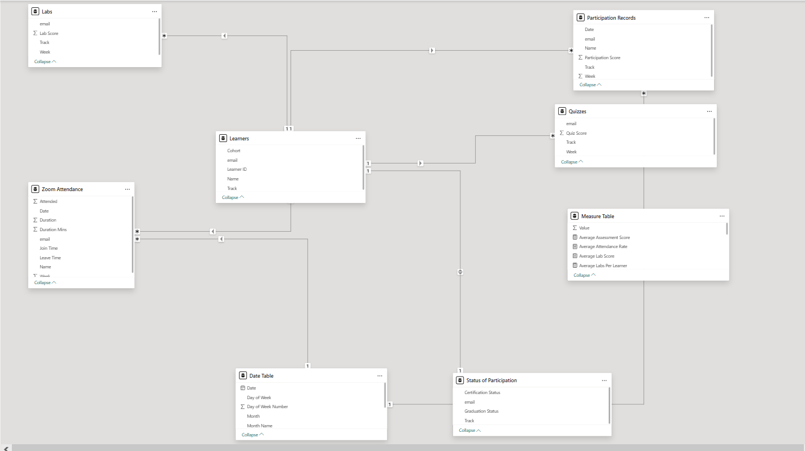

# Dare Careers – Student Progress & Performance Dashboard

**Power BI + AWS Cloud Integration Project**

---

##  Project Overview

Dare Careers is a training organization delivering professional programs in:

* **Power BI**
* **AWS Cloud**

To effectively monitor learner engagement, academic performance, and program outcomes, this project delivers a comprehensive **Power BI dashboard** that tracks:

* Daily Zoom attendance
* Daily participation
* Weekly lab and quiz scores
* Certification and graduation status
* Cohort-level and learner-level performance

The dashboard enables program managers and trainers to:

* Monitor engagement trends
* Identify at-risk learners
* Measure certification and graduation rates
* Compare performance across tracks and cohorts

---

# Project Development Approach

## Phase 1: Power BI (Standalone Model)

1. Data cleaning and transformation inside Power BI (Power Query)
2. Data modeling and relationship establishment
3. Creation of DAX measures
4. Dashboard design and visualization

This phase focused strictly on the **Power BI track dataset**.

---

## Phase 2: AWS Cloud Integration

1. Cleaned and structured AWS Cloud datasets
2. Applied the same modeling principles from Phase 1
3. Standardized fact tables
4. Appended AWS data to the Power BI dataset
5. Ensured model integrity and measure consistency

The final model supports:

* Multi-track reporting (Power BI + AWS)
* Unified learner analytics
* Cohort comparison across programs

---

# 🗂 Data Structure

## Zoom Attendance

* Separate raw data for Power BI and AWS tracks
* 10 weeks of data (Week 1 – Week 10)
* Daily attendance logs

**Attendance Rule:**

> A learner is marked as **Attended = 1** if Zoom Duration > 30 minutes

---

## Labs & Quizzes

* Weekly lab grades (10 weeks)
* Weekly quiz grades (10 weeks)
* Structured by Track and Week

---

## Participation Records

* Daily participation tracking
* Engagement scores per learner

---

## Status Records

* Certification Status
* Graduation Status
* Program Completion Status

---

# Data Modeling

The model follows a **Star Schema Architecture**.

## Fact Tables

* Zoom Attendance
* Participation Records
* Labs
* Quizzes

## Dimension Tables

* Learners
* Date Table
* Status of Participant

## Measures Table

* All DAX measures are centralized for performance optimization and organization.

---

# Data Model Evolution & Integration Strategy

This project was built iteratively rather than merging all datasets at once.

---

## Phase 1 – Power BI Track Model

* Cleaned and transformed Power BI data
* Built relationships between fact and dimension tables
* Created and validated DAX measures
* Designed initial dashboard pages

This allowed the business logic and KPIs to be tested in isolation.

---

## Phase 2 – AWS Cloud Track Replication

* Cleaned AWS dataset separately
* Replicated the same data structure
* Mirrored relationships and modeling logic
* Validated measures against AWS data

This ensured structural consistency across tracks.

---

## Phase 3 – Unified Multi-Track Model (Append Strategy)

* Appended AWS fact tables to Power BI fact tables
* Introduced a **Track column** for differentiation
* Reused shared dimension tables
* Maintained centralized measures

This resulted in a **single unified reporting model** supporting:

* Cross-track comparison
* Cohort-level analytics
* Program-wide KPIs

---

## Why AWS Tables Still Appear in the Model

Some AWS queries remain visible in the model diagram because:

* They are referenced in dependent transformations
* Removing them would break query dependencies
* They provide traceability to source data

The reporting layer uses appended tables, but source queries remain for structural integrity.

---

#  Data Model Screenshot



---

# Dashboard Pages

---

# Page 1: Overall Performance Metrics

##  Objective

Provide high-level program performance insights for stakeholders.

---

## Visualizations

### Bar Charts

* Graduation Rate %
* Certification Rate %
* Dropout Rate %
* Average Attendance %
* Average Participation %
* Average Assessment Score

### Summary Cards

* Total Learners
* Total Certifications
* Total Graduations
* Total Dropouts

### Filters (Slicers)

* Cohort
* Track (Power BI / AWS)
* Certification Status
* Learner Status

---

## Page 1 Screenshot


---

# Page 2: Detailed Learner Insights

##  Objective

Provide granular learner-level analytics for trainers and program managers.

---

## Visualizations

### Learner Table

Displays:

* Learner Name
* Track
* Attendance %
* Participation %
* Average Quiz Score
* Average Lab Score
* Certification Status
* Graduation Status

### Summary Cards

* Count of Labs
* Average Labs per Learner
* Total Hours in Class
* Average Attendance %
* Average Participation %
* Average Assessment Score

### Filters

* Cohort
* Track
* Month
* Week
* Learner Status
* Program Status

---

## Page 2 Screenshot


---

# Business Logic & Rules

## Attendance Rule

A learner is considered **Attended** if:

```
Zoom Duration > 30 minutes
```

This rule applies across all attendance calculations.

---

#  Key DAX Measures

All measures are centralized in the **Measures Table**.

---

## Certification & Graduation

```DAX
Certification Rate % =
DIVIDE([Total Certifications], [Total Learners], 0) * 100
```

```DAX
Graduation Rate % =
DIVIDE([Total Graduations], [Total Learners], 0) * 100
```

---

## Learner Counts

```DAX
Total Learners = DISTINCTCOUNT(Learners[email])
```

```DAX
Total Certifications =
CALCULATE(
    COUNTROWS('Status of Participant'),
    'Status of Participant'[Certification Status] = "Certified"
)
```

---

## Attendance Metrics

```DAX
Attended Sessions =
CALCULATE(
    COUNTROWS('Zoom Attendance'),
    'Zoom Attendance'[Attended] = 1
)
```

```DAX
Total Hours in Class =
VAR AttendedMinutes =
    CALCULATE(
        SUM('Zoom Attendance'[Duration Mins]),
        'Zoom Attendance'[Attended] = 1
    )
RETURN
DIVIDE(AttendedMinutes, 60, 0)
```

```DAX
Average Attendance % =
DIVIDE([Total Hours in Class] * 60, [Total Class Sessions]*120)
```

---

## Assessment Metrics

```DAX
Average Lab Score = AVERAGE(Labs[Lab Score])
```

```DAX
Average Quiz Score = AVERAGE(Quizzes[Quiz Score])
```

```DAX
Average Assessment Score =
DIVIDE(
    [Average Lab Score] + [Average Quiz Score],
    2,
    0
)
```

---

## Participation Metrics

```DAX
Average Participation % =
[Total Participation Records] / [Attended Sessions]
```

```DAX
Duplicate Participation Count =
SUMX(
    SUMMARIZE(
        'Participation Records-2',
        'Participation Records-2'[email],
        'Participation Records-2'[Date],
        "RowCount", COUNTROWS('Participation Records-2')
    ),
    IF([RowCount] > 1, [RowCount] - 1, 0)
)
```

---

# Key Insights Enabled

This dashboard allows Dare Careers to:

* Identify learners below attendance thresholds
* Track weekly engagement trends
* Monitor certification performance per cohort
* Compare AWS vs Power BI track performance
* Detect duplicate participation entries
* Measure overall program effectiveness

---

# Technologies Used

* Power BI Desktop
* DAX (Data Analysis Expressions)
* Star Schema Data Modeling
* AWS Cloud Dataset Integration
* Power Query (ETL & Transformation)

