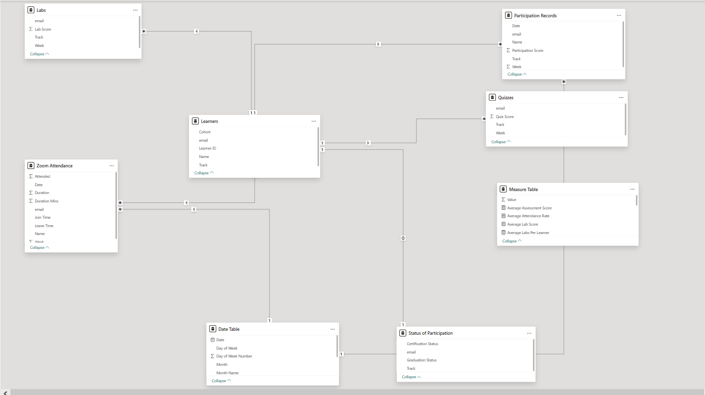
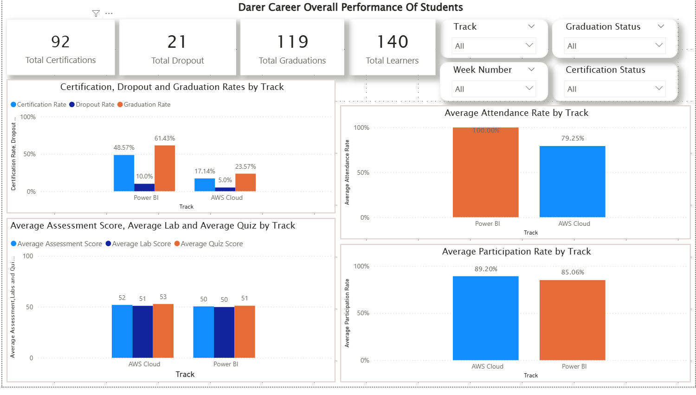
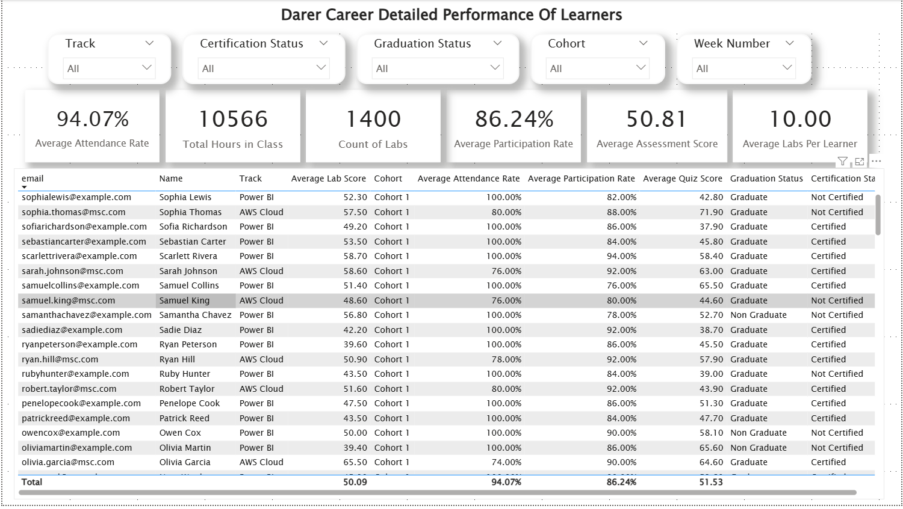

# Dare Careers – Student Progress & Performance Dashboard

**Power BI + AWS Cloud Integration Project**

---

## 1. Executive Summary

Dare Careers is a professional training organization delivering structured programs in:

* Power BI
* AWS Cloud

This project delivers a unified Power BI analytics dashboard that monitors learner engagement, academic performance, certification outcomes, and graduation rates across both tracks.

The solution integrates datasets from separate programs into a single, scalable reporting model built using star schema architecture and advanced DAX logic.

The dashboard enables stakeholders to:

* Monitor attendance and participation trends
* Identify at-risk learners early
* Measure certification and graduation outcomes
* Compare performance across tracks and cohorts
* Evaluate overall program effectiveness

---

## 2. Project Architecture & Development Strategy

The solution was developed in three structured phases to ensure modeling accuracy, validation, and scalability.

---

### Phase 1 – Power BI Track Model (Standalone Build)

* Data cleaning and transformation using Power Query
* Data modeling and relationship design
* DAX measure creation and validation
* Initial dashboard development

This phase focused exclusively on validating business logic and KPIs using the Power BI track dataset in isolation.

---

### Phase 2 – AWS Cloud Track Replication

* Independent cleaning and structuring of AWS datasets
* Replication of star schema structure
* Validation of DAX logic consistency
* Testing performance behavior across datasets

This ensured structural consistency before integration.

---

### Phase 3 – Unified Multi-Track Model (Append Strategy)

* Appended AWS fact tables to Power BI fact tables
* Introduced a Track column for differentiation
* Centralized shared dimension tables
* Reused validated DAX measures
* Preserved query lineage for traceability

The final model supports:

* Cross-track comparison
* Cohort-level analytics
* Program-wide KPI reporting
* Filter-safe executive metrics

---

## 3. Data Structure Overview

### Fact Tables

* Zoom Attendance
* Participation Records
* Labs
* Quizzes

### Dimension Tables

* Learners
* Date Table
* Status of Participation
* Track

### Measures Table

All DAX measures are centralized in a dedicated Measures table to:

* Improve model organization
* Enhance maintainability
* Reduce ambiguity
* Improve performance

---

## 4. Business Logic & Definitions

### Attendance Rule

A learner is considered to have attended a session if:

Zoom Duration > 30 minutes

This rule ensures brief joins or accidental logins are excluded.

---

### Participation Rule

A learner is considered to have participated if their name appears in the Participation Records table for that class date.

Participation measures active classroom engagement beyond Zoom presence.

---

## 5. Key DAX Measures

All measures are centralized in the Measures table.

---

# COUNT / WHOLE NUMBER MEASURES

---

### Total Learners

```DAX
Total Learners = DISTINCTCOUNT(Learners[email])
```

Counts unique learners using email as the primary identifier.

---

### Total Graduations

```DAX
Total Graduations =
CALCULATE(
    COUNTROWS('Status of Participation'),
    'Status of Participation'[Graduation Status] = "Graduate"
)
```

Counts learners who successfully completed the program.

---

### Total Non Graduates

```DAX
Total Non Graduates =
CALCULATE(
    COUNTROWS('Status of Participation'),
    'Status of Participation'[Graduation Status] = "Non Graduate"
)
```

Used as the dropout proxy, since there is no explicit dropout field.

---

### Total Certifications

```DAX
Total Certifications =
CALCULATE(
    COUNTROWS('Status of Participation'),
    'Status of Participation'[Certification Status] = "Certified"
)
```

Counts learners who achieved certification.

---

### Count of Labs

```DAX
Count of Labs = COUNTROWS(Labs)
```

Total lab submissions across all learners and weeks.

---

### Total Attended Sessions

```DAX
Total Attended Sessions = SUM('Zoom Attendance'[Attended])
```

Counts all valid attendance instances (Attended = 1).

---

### Total Class Sessions

```DAX
Total Class Sessions =
DISTINCTCOUNT('Zoom Attendance'[Date])
```

Counts the total number of distinct Zoom session dates.

---

### Total Possible Participation Days

```DAX
Total Possible Participation Days =
CALCULATE(
    DISTINCTCOUNT('Participation Records'[Date]),
    ALL('Participation Records'[email])
)
```

Counts total class days independent of learner-level filters.

---

### Total Hours in Class

```DAX
Total Hours in Class =
DIVIDE(
    CALCULATE(
        SUM('Zoom Attendance'[Duration Mins]),
        'Zoom Attendance'[Attended] = 1
    ),
    60,
    0
)
```

Converts attended minutes into hours.

---

# RATE MEASURES

All rate measures are formatted as percentages.

---

### Graduation Rate

```DAX
Graduation Rate =
DIVIDE(
    CALCULATE(
        COUNTROWS('Status of Participation'),
        'Status of Participation'[Graduation Status] = "Graduate",
        ALL('Status of Participation'[Certification Status])
    ),
    CALCULATE(
        COUNTROWS(Learners),
        ALL('Status of Participation')
    ),
    0
)
```

Calculates graduation percentage independent of slicer distortions.

---

### Certification Rate

```DAX
Certification Rate =
DIVIDE(
    CALCULATE(
        COUNTROWS('Status of Participation'),
        'Status of Participation'[Certification Status] = "Certified",
        ALL('Status of Participation'[Certification Status])
    ),
    CALCULATE(
        COUNTROWS(Learners),
        ALL('Status of Participation')
    ),
    0
)
```

Calculates certification percentage independent of certification slicers.

---

### Dropout Rate

```DAX
Dropout Rate =
DIVIDE(
    CALCULATE(
        COUNTROWS('Status of Participation'),
        'Status of Participation'[Graduation Status] = "Non Graduate",
        ALL('Status of Participation'[Certification Status])
    ),
    CALCULATE(
        COUNTROWS(Learners),
        ALL('Status of Participation')
    ),
    0
)
```

Represents learners who did not graduate as a percentage of total learners.

---

# AVERAGE PERFORMANCE MEASURES

---

### Average Attendance Rate

```DAX
Average Attendance Rate =
AVERAGEX(
    Learners,
    DIVIDE(
        COALESCE(CALCULATE(SUM('Zoom Attendance'[Attended])), 0),
        CALCULATE(
            DISTINCTCOUNT('Zoom Attendance'[Date]),
            ALL('Zoom Attendance')
        ),
        0
    )
)
```

Measures the proportion of Zoom sessions each learner attended.

---

### Average Participation Rate

```DAX
Average Participation Rate =
VAR TotalDays =
    CALCULATE(
        DISTINCTCOUNT('Participation Records'[Date]),
        ALL('Participation Records')
    )
RETURN
    AVERAGEX(
        Learners,
        DIVIDE(
            COALESCE(CALCULATE(COUNTROWS('Participation Records')), 0),
            TotalDays,
            0
        )
    )
```

Measures proportion of class days learners actively participated.

---

# ACADEMIC PERFORMANCE MEASURES

---

### Average Quiz Score

```DAX
Average Quiz Score =
AVERAGE(Quizzes[Quiz Score])
```

Mean quiz performance on a 0–100 scale.

---

### Average Lab Score

```DAX
Average Lab Score =
AVERAGE(Labs[Lab Score])
```

Mean lab performance on a 0–100 scale.

---

### Average Assessment Score

```DAX
Average Assessment Score =
DIVIDE(
    CALCULATE(SUM(Quizzes[Quiz Score])) +
    CALCULATE(SUM(Labs[Lab Score])),
    CALCULATE(COUNT(Quizzes[Quiz Score])) +
    CALCULATE(COUNT(Labs[Lab Score])),
    0
)
```

Weighted combined average of all quiz and lab submissions.

---

### Average Labs Per Learner

```DAX
Average Labs Per Learner =
VAR TotalLabs = COUNTROWS(Labs)
VAR TotalLearners = DISTINCTCOUNT(Learners[email])
RETURN DIVIDE(TotalLabs, TotalLearners, 0)
```

Represents average lab submission rate per learner.

---

## 6. Dashboard Structure

### Page 1 – Executive Performance Overview

Displays:

* Graduation Rate
* Certification Rate
* Dropout Rate
* Average Attendance Rate
* Average Participation Rate
* Average Assessment Score
* Total Learners
* Total Certifications
* Total Graduations
* Total Dropouts

Includes slicers for:

* Cohort
* Track
* Certification Status
* Learner Status

---

### Page 2 – Learner-Level Insights

Displays:

* Learner Name
* Track
* Attendance Rate
* Participation Rate
* Average Quiz Score
* Average Lab Score
* Certification Status
* Graduation Status

Includes supporting summary metrics:

* Total Hours in Class
* Average Labs per Learner
* Total Lab Submissions

---

## 7. Technical Stack

* Power BI Desktop
* DAX (Data Analysis Expressions)
* Power Query (ETL and transformation)
* Star Schema Data Modeling
* AWS Cloud dataset integration

---

## 8. Key Design Decisions

* Star schema for scalability and performance
* Centralized measures table
* ALL() usage to protect executive KPIs from slicer distortion
* COALESCE() to prevent learner exclusion from averages
* Weighted assessment calculation for mathematical accuracy
* Append strategy for multi-track scalability


## 9. Data Model

The solution is built using a star schema architecture with centralized measures and shared dimensions.



---

## 10. Dashboard – Executive Performance Overview

This page provides high-level program KPIs for stakeholders.



---

## 11. Dashboard – Learner-Level Insights

This page provides granular learner analytics for trainers and program managers.



---
